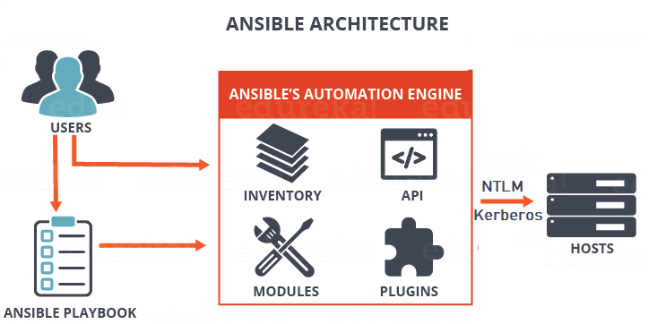

# AnsiblePlaybooks
Ansible is a python package used to setup application on different machines. 


## How to setup

I've used red hat enterprise linux. For windows, either enable WSL or install using cygwin

1. Install latest version of Python  
2. Install other dependencies python3-dev, python3-venv, python3-pip. 
    - As per linux flavour, use the installation server for eg. apt-get or yum
3. Run `python3 -m venv ansible-2.9.1`
    - Please specify the version of the ansible wanted to install
    - Once it is executed a virtual env by the name of ansible-2.9.1 will create
    - You can specify any name for `venv` but its a good practice to specify version
4. Run `source ansible-2.9.1/bin/activate`
    - This will activate the created virtual environment
    - Now, all the pip installations will be done within this environment only
    - In this way, different files will not flood your machine
5. Once in a virtual environment run
    - `pip install wheel`
    - `pip install pywinrm`
    - `pip install ansible==2.9.1`
        - If version is not defined then latest version will install
6. Make sure your ansible is targeting the correct python3 compiler
    - Run, `head -n 1 $(which ansible) `
        - Make sure it will return something like this #!/usr/bin/python3
        - Otherwise, go through this [link](https://docs.ansible.com/ansible/latest/reference_appendices/python_3_support.html) for manually changing the interpreter
7. Run `deactivate`
    - To exit the virtual environment



 Your ansible is up and running. Now transfer the host file to `/etc/ansible` and run this command to execute your first playbook
 ```
 ansible-playbook <playbook>.yml -k -vvv
 ```
